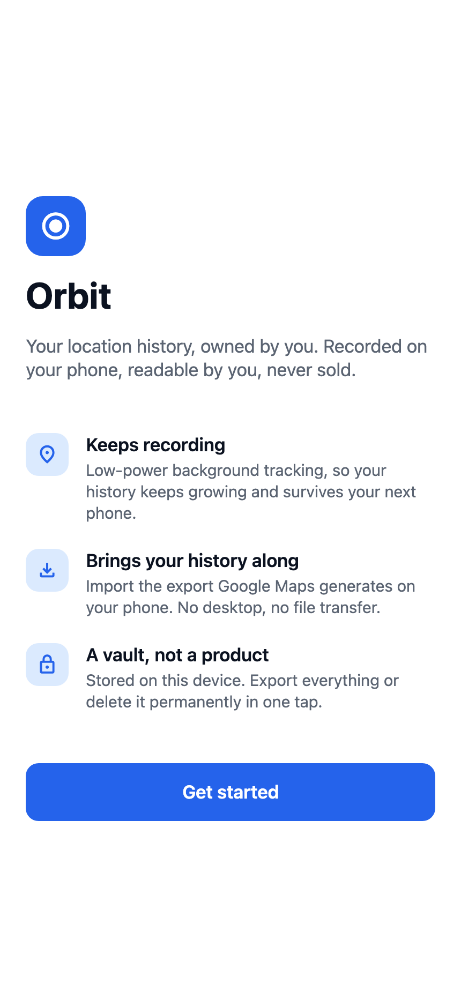
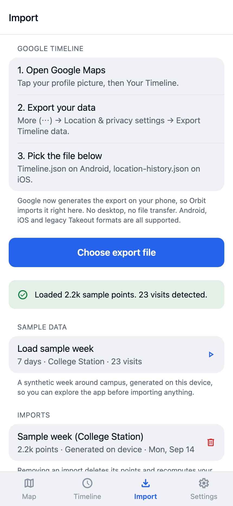
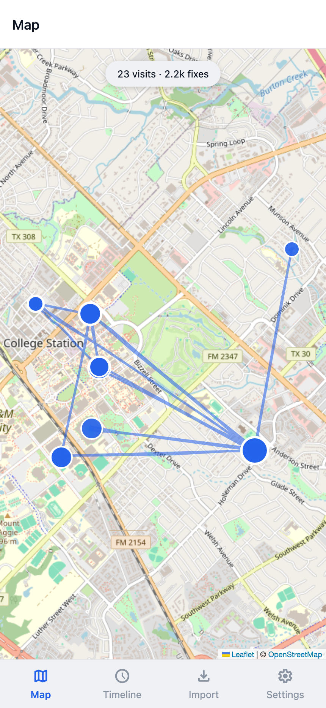
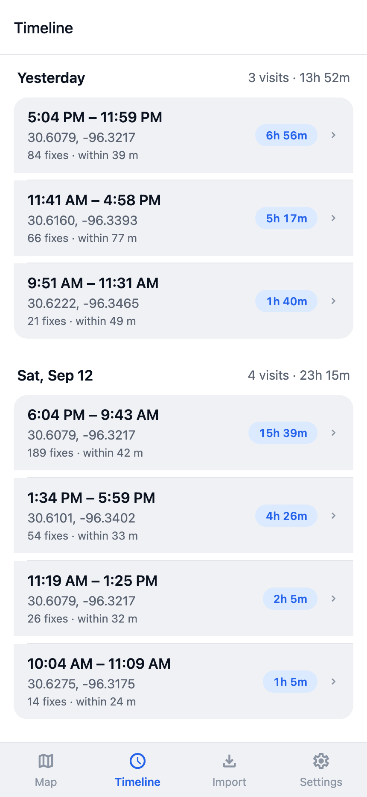
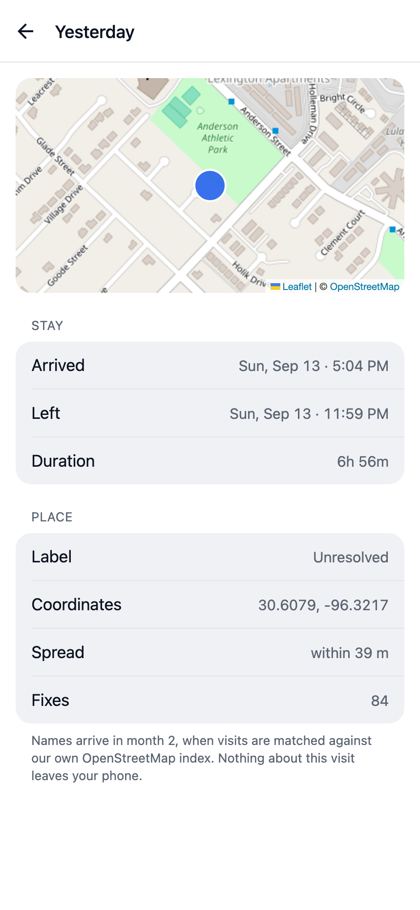
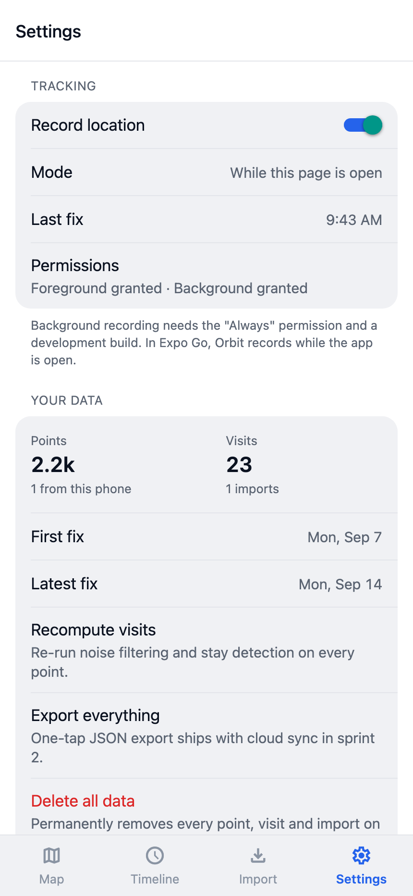

# Orbit – Iteration 1 Progress Report (Week 1)

Team Adobe: George Dai (lead), Zayd Nadir, Tanish Bandari, Hussam Makhoul, Roger Liu
CSCE 482 · September 14, 2026

Orbit is a mobile app that records your location history on your own phone, imports your Google Timeline export, and shows your visits on a map and a timeline.

## What we did last week

- Presented the product proposal and the three-month plan.
- Built the first version of the app (Expo / React Native, runs on iOS, Android, and web) with onboarding, location permissions, and four tabs: Map, Timeline, Import, Settings.
- Location tracking records in the background in a real build, and while the app is open in Expo Go.
- Importing a Google Timeline export works for the Android, iOS, and old Takeout formats.
- Raw points are cleaned and turned into visits with a stay-detection algorithm. On a synthetic test week it finds all 23 visits with no false positives.
- Started the backend (FastAPI): accounts, point upload, visit recompute, and full export.
- 71 app tests and 17 backend tests pass; CI runs them on every push.

## What we are doing this week

- Everyone runs the app in Expo Go and imports their own Google Timeline export.
- Make development builds so we can test background tracking on real phones.
- Connect the app to the backend (sign in, upload points).
- Submit the IRB protocol and start the GeoLife baseline.
- Design the app icon, splash screen, and sign-in screen.

## What we will do by the end of Iteration 1

The goal is v0.1 alpha: background tracking runs for a week unattended, all five team exports import, and visits show on a map. The map part is done; the other two depend on the dev builds and real exports this week. After that we finish cloud sync, handle very large exports, and start hand-labeling real data to measure accuracy.

## Screenshots

| | | |
| --- | --- | --- |
|  |  |  |
|  |  |  |
