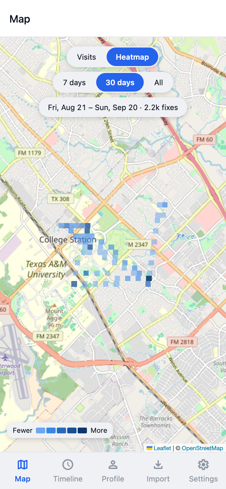
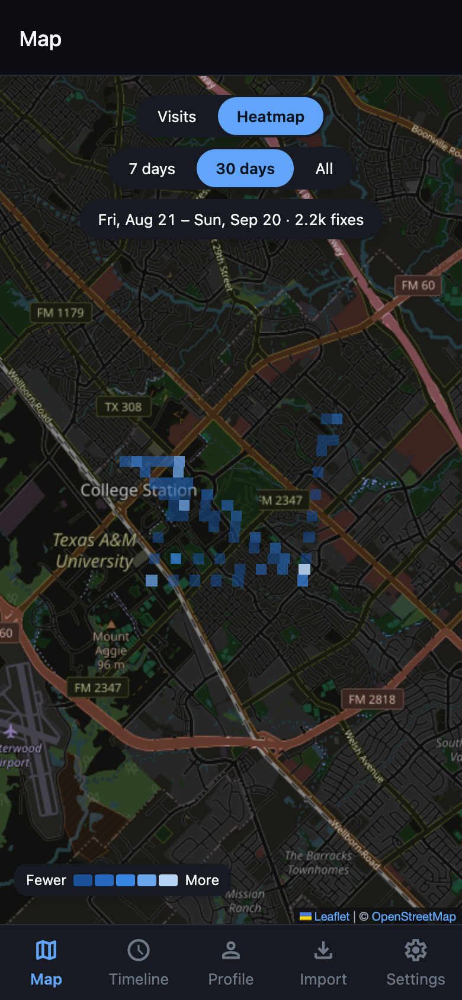
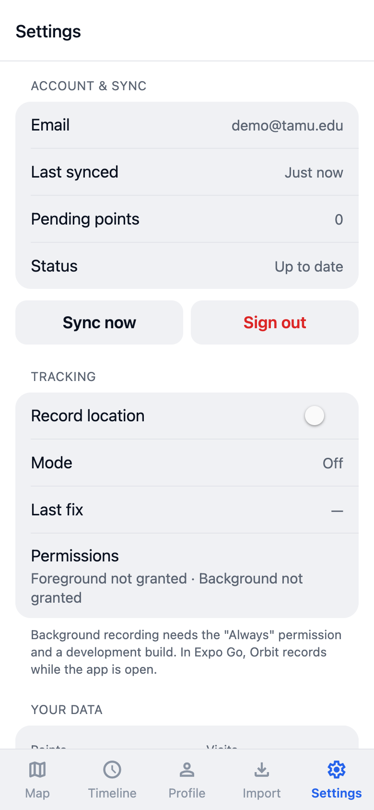
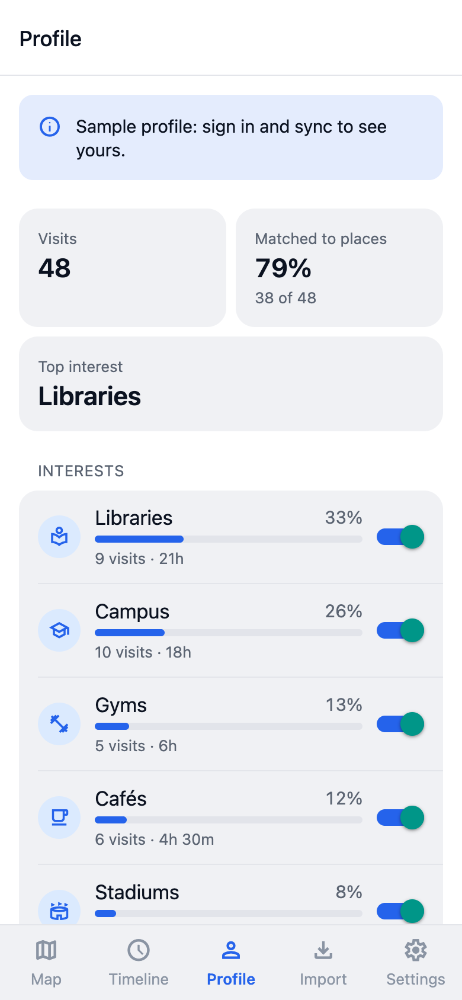
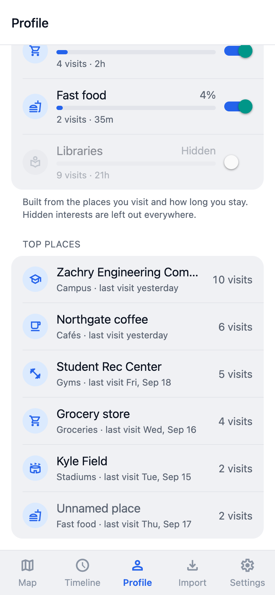
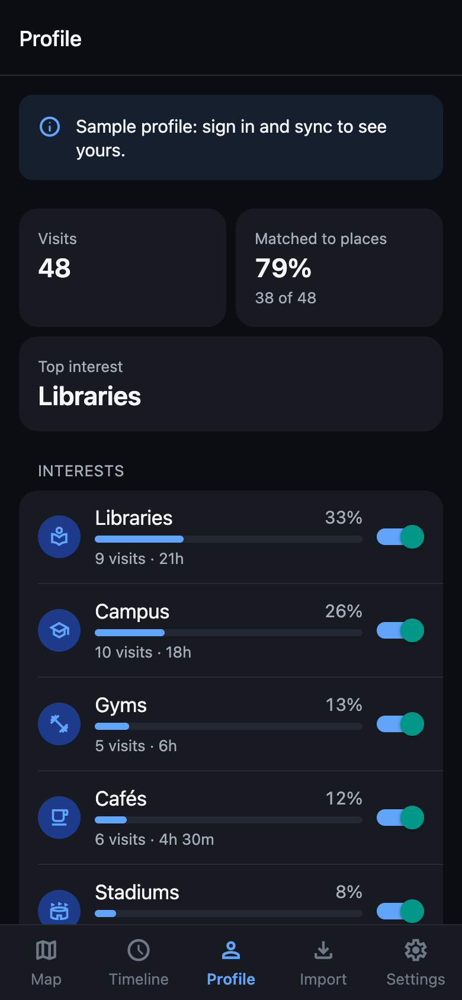

# Orbit – Iteration 2 Progress Report (Week 1)

Team Adobe: George Dai (lead), Zayd Nadir, Tanish Bandari, Hussam Makhoul, Roger Liu
CSCE 482 · September 21, 2026

Orbit is a mobile app that records your location history on your own phone, imports your Google Timeline export, and shows your visits on a map and a timeline. Iteration 2 is about interpreting that history: turning each visit into a real place, and those places into an interest profile you can see and edit.

## What we did last week

We split Iteration 2 in half. Part 1 (places and the interest profile) was built and merged this week. We agreed on a shared data contract first, so all five of us could start on day one without waiting for each other.

- **Place resolution (Roger).** Given a visit and the places near it, the ranker decides which one you were at, and how sure it is. It uses distance, visit length, opening hours and how often you've been there. The interest model turns resolved visits into weights per category, with older visits counting less.
- **Places and profile API (Zayd).** We now have our own OpenStreetMap place index, filled by a loader script, so place resolution never sends your visits to a third-party service. `POST /visits/recompute` attaches a place to each visit when the ranker is confident enough. `GET /profile` returns your interests and top places, and you can hide any category.
- **Sign-in and sync (Tanish).** The app signs in and uploads its points to the backend in batches of 1,000. It tracks what has already been uploaded, so a dropped connection resumes where it stopped without losing or duplicating points, and it retries with backoff. End to end, the sample week (2,177 points) synced with nothing left pending.
- **Heatmap and Profile tab (Hussam).** The Map tab has a heatmap mode with 7-day, 30-day and all-time ranges, in light and dark mode. A new Profile tab shows your interests with show/hide switches and your most-visited places. For now it uses a sample profile with the same shape as the API.
- **Evaluation (George).** A harness scores any place ranker on hand-labeled visits with one command, and a written protocol sets out how we'll label three weeks of our own data.
- All five PRs are merged into `main`. 103 app tests and 133 backend tests pass, and every check CI runs (typecheck, tests, expo-doctor, backend tests) passes on `main`.

### First accuracy numbers

These come from George's harness (`cd backend && python -m evaluation.places`) on the committed synthetic set: 40 visits around campus, 36 at a real place and 4 deliberately at no place.

| Ranker | Top-1 | Top-3 | Precision | Recall | No place assigned |
| --- | --- | --- | --- | --- | --- |
| Nearest place (baseline) | 88.9% | 100% | 83.8% | 86.1% | 7.5% |
| Random (sanity check) | 22.2% | 69.4% | 0.0% | 0.0% | 92.5% |
| **Roger's ranker** | **100%** | **100%** | **97.1%** | **91.7%** | 15.0% |

The ranker fixes the cases where distance alone gets it wrong, such as a café inside the library or a smoothie counter inside the gym. It is more cautious, though: it leaves 15% of visits without a place, compared with 7.5% for the baseline. Three of its four misses are real places it wasn't confident enough to assign. This set is synthetic and tidy, so these numbers are optimistic. The real accuracy number will come from hand labels.

## What we are doing this week

- Load the real College Station OpenStreetMap extract and run place resolution on our own imported history.
- Start hand-labeling following `docs/eval/labeling-protocol.md`: each of us labels only our own visits, and 10% get a blind second label so we can report agreement. Label files stay off GitHub; they are gitignored and covered by the IRB protocol.
- Connect the Profile tab to the live `/profile` API now that sign-in and sync are merged.
- Make development builds so we can test background tracking and sync on real phones.

## What we will do by the end of Iteration 2

The goal is v0.5 beta: profile, recommendations and predictions live in the app. Part 1 is merged: visits get places, and the profile exists on both the server and in the app. Part 2 adds recommendations (including nearby suggestions), the next-place predictor, and the popularity baseline the recommender has to beat. The main risks are gaps in OpenStreetMap coverage (if a place isn't in the index, no ranker can pick it), collecting enough labeled visits (roughly 300), and background tracking on real phones, which needs development builds.

## Screenshots

| | | |
| --- | --- | --- |
|  |  |  |
|  |  |  |
