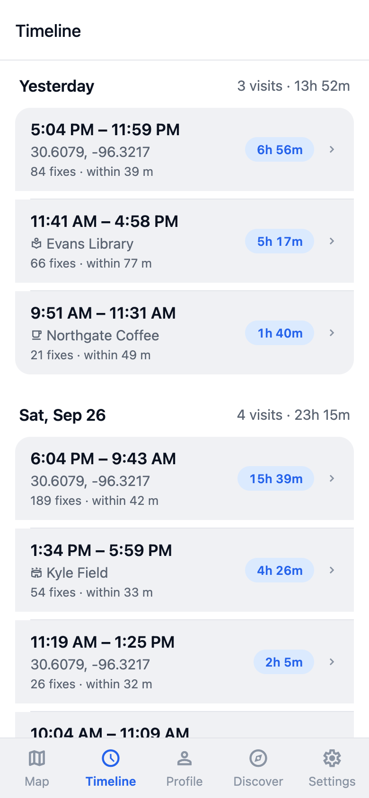
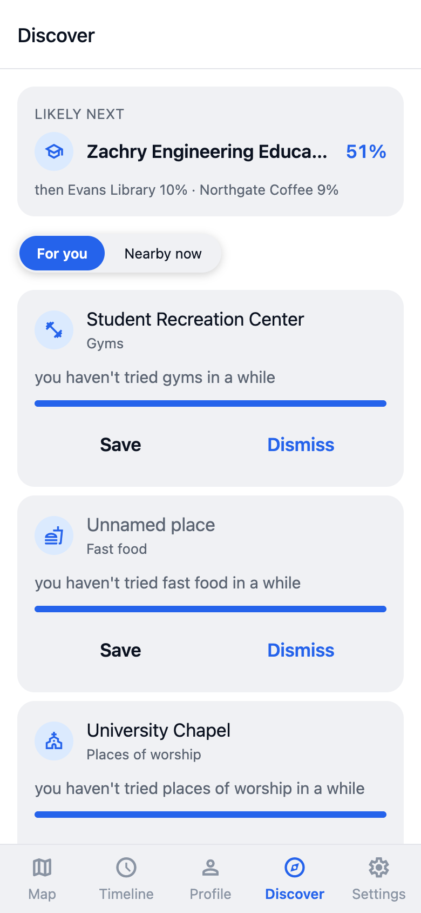
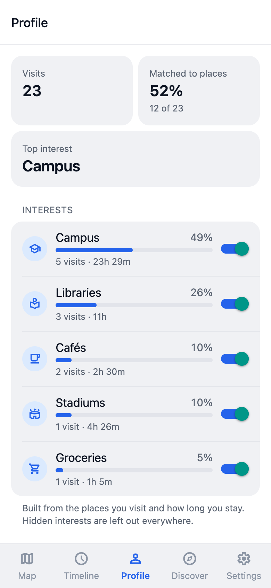
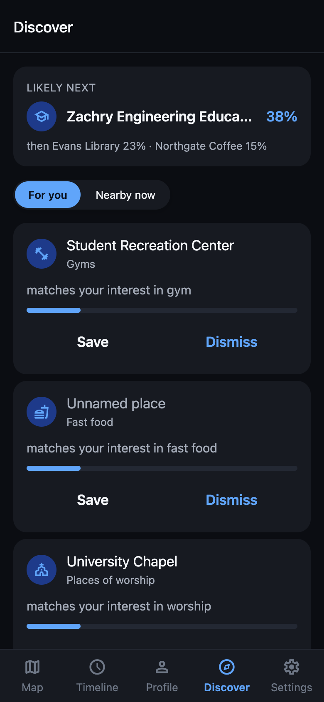
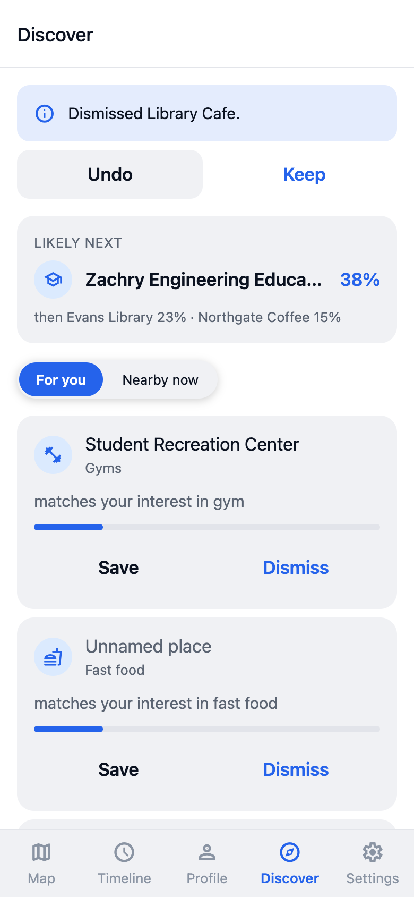
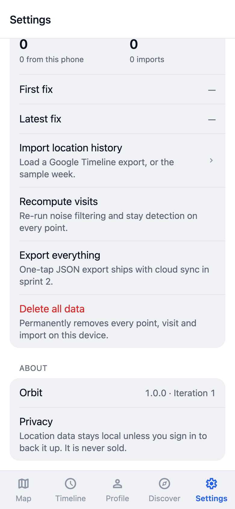

# Orbit – Iteration 2 Progress Report (Week 2)

Team Adobe: George Dai (lead), Zayd Nadir, Tanish Bandari, Hussam Makhoul, Roger Liu
CSCE 482 · September 28, 2026

Orbit records your location history on your own phone, turns it into visits, and matches those visits to real places. This week finished Iteration 2: the app now suggests places to try and predicts where you are likely to go next.

## What we did last week

Part 2 is built and merged. Six pull requests went into `main`, and the whole stack runs together.

- **Recommender and predictor (Roger).** The recommender scores places you have never been against your interest profile, using how long you tend to stay, whether the place is open, and how long it has been since you tried that kind of place. The predictor blends where you usually go next, the time of day and day of week, and how recently you went.
- **Recommendation API (Zayd).** `GET /recommendations` and `/recommendations/nearby` return suggestions with a one-line reason each; `GET /predict/next` returns the three most likely next places. Saving or dismissing a suggestion is remembered, and a dismissed place never comes back.
- **Background jobs and two-way sync (Tanish).** Recompute no longer blocks a request: it is queued and a worker process runs it, with retries and a job status endpoint. Sync now works in both directions, so the phone gets the server's resolved visits and their place names back.
- **Discover screen and live profile (Hussam).** The Profile tab shows your real profile instead of the sample. Visits show real place names with category icons on the timeline, the map and visit detail. The new Discover tab has a "likely next" card and a suggestion list with Save, Dismiss and Undo, plus a "Nearby now" mode.
- **Evaluation (George).** A second harness measures recommendations against a popularity baseline on held-out months, and prediction against a most-frequent-place baseline, on a 12-week synthetic history.
- 254 backend tests and 127 app tests pass, and every check CI runs passes on `main`.

### Accuracy this week

All numbers are from George's harnesses on synthetic data (`cd backend && python -m evaluation.places | recommend | predict`). Synthetic data is tidier than real life, so these are optimistic.

| What | Ours | Baseline | Reading |
| --- | --- | --- | --- |
| Place resolution (top-1) | **100%** | 88.9% nearest place | Fixes the cases distance alone gets wrong |
| Place resolution (precision) | **97.1%** | 83.8% | Assigns fewer visits, but is right when it does |
| Next place (top-1) | **84.9%** | 16.0% most-frequent | Time of day and day of week do most of the work |
| Next place (top-3) | **89.2%** | 61.8% | |
| Recommendations, new places (hit@10) | 15.8% | **18.4% popularity** | **Below the bar — see below** |
| Recommendations (MRR) | **8.0%** | 5.5% | When it is right, it ranks it higher |
| Recommendations (catalog covered) | **30.5%** | 15.0% | Suggests twice as many different places |

**The recommender does not yet clear the popularity baseline, which is this iteration's exit criterion.** It is 2.6 points behind at k=10. The reason is visible in the other two rows: it deliberately spreads suggestions across categories and places, which costs hit-rate against a baseline that just names the most popular places over and over. Roger has the tuning knobs for that trade-off, and the harness now reports it on every run, so next week's job is to find the setting that keeps the variety and clears the bar.

## What we are doing this week

- Tuning the recommender against the harness until it beats the popularity baseline, and re-checking the trade-off between variety and hit-rate.
- Hand-labeling three weeks of our own history (`docs/eval/labeling-protocol.md`), so we can report real accuracy instead of synthetic. `docs/eval/results.md` is waiting with every number marked TODO.
- Battery profiling of background tracking, which was cut from Part 2 when the sprint filled up, plus development builds so we can test on real phones.
- Loading the full College Station map extract and running everything against our own imported history.

## What we will do by the end of Iteration 2

v0.5 beta is feature-complete in the app: profile, recommendations and predictions are all live. What is left is evidence, not code: the recommender over the baseline, real hand-labeled accuracy, and a battery measurement. Iteration 3 is then about owning your data end to end.

## Screenshots

| | | |
| --- | --- | --- |
|  |  |  |
|  |  |  |
